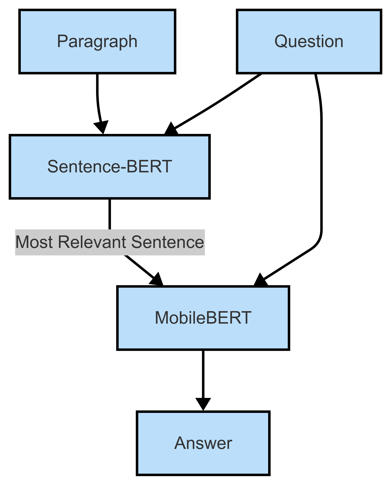

# Extractive Question Answering

Code and report for a question-answering system.  

**Models:** [🤗 MobileBERT](https://huggingface.co/google/mobilebert-uncased) | [🤗 Sentence-BERT](https://huggingface.co/sentence-transformers/all-MiniLM-L6-v2)

**Dataset:** [SQuADv2.0](https://rajpurkar.github.io/SQuAD-explorer/)

*Figure 1: Question Answering System*
